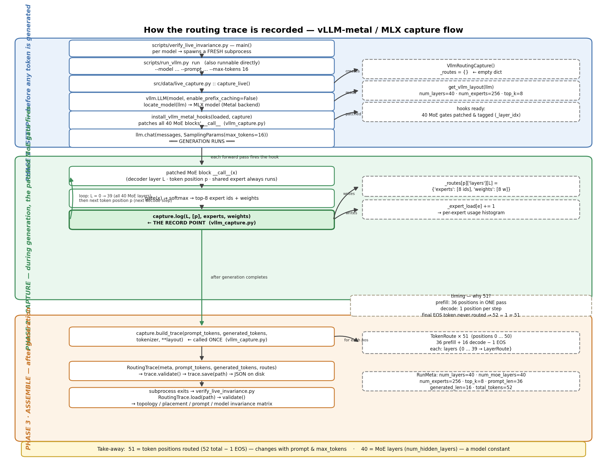

# MoE + OCS Research Testbed

Capture **real MoE routing** on real models, then measure what that routing
actually lets you exploit on a 3-tier electrical fabric (EPS): expert
placement, communication cost, and — as a bounded feasibility question —
optical circuit switching (OCS).

```
models (real) ──▶ captured routing traces ──▶ per-layer affinity ──▶ placement / cost / OCS feasibility
```

---

## The result (measured, out-of-sample)

The publishable contribution is a **placement** result, not an OCS result.

> For a fixed model state, logical token→expert routing is independent of
> expert placement and network topology. The cost that routing induces is
> governed by two quantities recoverable from traces: how many distinct
> destination ranks each token must reach (**fan-out**), and how unevenly
> arriving messages concentrate on ranks (**dedup ingress skew**). Expert
> co-activation is a useful pairwise relaxation of the first — but only
> when optimised **per layer** and **jointly balanced across layers**.
> Applied naively it is *worse than random*.

Qwen3.6-35B (E=256, K=8), leave-categories-out, EP=32:

| placement | bottleneck vs random |
|---|---|
| random (the correct null) | 0 % |
| linear (the deployed default) | +4.6 % |
| load-balanced alone | +11.1 % |
| affinity, layer-pooled | +7.4 % |
| affinity, per-layer, **independent** | **−100.6 %** (2× worse than random) |
| **affinity, per-layer, coordinated** | **+32.8 %** |
| adversarial (upper bound) | −129.9 % |

The −100.6 % row is the instructive one: naive per-layer affinity clustering
co-locates the popular experts (they co-occur with everything), cuts volume
33 %, and *triples* ingress imbalance. The metric that "improves" under that
clustering (`intra_rank_affinity_fraction`) rises monotonically with exactly
the clustering that destroys the collective. Balancing must be joint across
layers; the objective must be `dedup_ingress`, not selection counts.

**OCS is a feasibility section, not a headline** ([`docs/research_assessment.md`](docs/research_assessment.md) §4):
the rank×rank traffic matrix is 99.9 % rank-1 (tokens are sharded
independently of content, so there is no pairwise structure to engineer
around); at realistic pod sizes (256 GPU/pod) no EP degree these models reach
produces cross-pod traffic for a circuit to promote; and where circuits do
apply (small-pod assumption), a static fit-only plan captures ~8.9 % of the
critical path while dynamic control is unjustified — circuit-plan Jaccard
across request windows is 0.09, i.e. churn is weight-tie noise, not workload
shift.

## The staged evidence chain (`src/eval/`)

Five questions, each allowed to FAIL and say why. Every number below is
reproducible; read [`docs/research_assessment.md`](docs/research_assessment.md)
for the full claim→gate→report ledger and the list of discarded metrics.

```bash
# 1. capture routing over a 112-sequence factorial workload suite (MLX; no vLLM needed)
python3 scripts/capture_workload.py \
    --model models/Qwen1.5-MoE-A2.7B-Chat-4bit \
    --out logs/workload/qwen15 --max-tokens 96                       # ~5.5 min

python3 scripts/capture_workload.py \
    --model models/Qwen3.6-35B-A3B-4bit \
    --out logs/workload/qwen36 --max-tokens 64 \
    --per-category 4 --n-repeats 3                                   # ~6.5 min

python3 scripts/capture_workload.py \
    --model models/Qwen3.8-Whittle-MoE-27B-A17.8B-4bit \
    --out logs/workload/whittle --max-tokens 64 \
    --per-category 4 --n-repeats 3                                   # ~18 min

# 2. Q1..Q5 evidence chain
python3 scripts/verify_live_invariance.py \
    --workload logs/workload/qwen36 --world-size 32 \
    --topology single_pod --topology multi_pod --topology realistic

# 3. figures
python3 scripts/make_figures.py --workload logs/workload/qwen36
```

| stage | question | Qwen1.5 (E=60,K=4) | Qwen3.6 (E=256,K=8) | Whittle (E=64,K=16) |
|---|---|---|---|---|
| Q1 | routing decoupled from placement/topology? | PASS, gate bit-exact | PASS, gate bit-exact | PASS, gate bit-exact |
| Q2 | does routing carry workload structure? | PASS — 62.5 % category decoding (null 6.4 %) | PASS — **93.75 %** (null 6.0 %) | PASS — 89.6 % (null 5.8 %) |
| Q3 | does placement change cost of fixed routing? | PASS — 3.7 % spread | PASS — 13.3 % spread | PASS — 3.2 % spread |
| Q4 | does affinity beat random / load-balancing OOS? | PASS — +18.8 % | PASS — **+32.8 %** | PASS — **+19.3 %** (pooled only +1.7 %) |
| Q5 | can OCS help after reconfiguration? | FAIL — no cross-pod traffic at EP=15 | conditional — 8.9 % under a small-pod assumption; plan Jaccard 0.09 | conditional — 8.6 % under a small-pod assumption; plan Jaccard 0.21 |

### Model-dependence: pooled placement collapses with sparsity, coordinated does not

Payoffs below are leave-categories-out, out-of-sample, vs the random null at
EP=32 (`logs/workload/*/evidence_chain.json`):

| model | E | K | K/E | per-layer load skew | global (layer-pooled) affinity | **coordinated per-layer** | naive per-layer |
|---|---|---|---|---|---|---|---|
| Qwen3.6-35B-A3B | 256 | 8 | 3.1 % | 10.54× uniform | +7.4 % | **+32.8 %** | −100.6 % |
| Qwen1.5-MoE-A2.7B | 60 | 4 | 6.7 % | 1.64× uniform | — | +16.1 % (fanout-layer best +18.8 %) | +16.7 % |
| Qwen3.8-Whittle | 64 | 16 | 25 % | 3.16× uniform | **+1.7 %** | **+19.3 %** | −78.8 % |

Read the Whittle row carefully — it is the sharpest version of the paper's
lesson. At K/E = 25 % fan-out is nearly saturated (`min(K,W) = 16` of 32
ranks), and the earlier assessment correctly found *global* affinity
placement buys nothing there (~0 %). But the **coordinated per-layer**
formulation still recovers **+19.3 %**, because at high K/E the win comes
from joint ingress balancing rather than destination coalescing (pure load
balancing alone: +9.5 %). The regime caveat applies to the pooled method,
not to the formulation. Naive per-layer affinity remains catastrophic in
every regime (−78.8 % here).

### New modules

| module | role |
|---|---|
| `src/serving/suite.py` | 112-prompt factorial workload: 12 categories, paraphrase sets (same meaning / different words), lexical controls (same words / different meaning), length ladders, identical-prompt repeats for the **noise floor** |
| `scripts/capture_workload.py` | loads the model once, captures a trace per prompt + a manifest that is the design matrix |
| `src/eval/trace_ir.py` | `CellTable` — the immutable canonical routing IR; per-layer expert namespaces are first-class |
| `src/eval/affinity_graph.py` | 6 affinity definitions + a **load-preserving null** (popular experts co-occur because they are popular) |
| `src/eval/specialization.py` | category decoding and MI with **run-level** permutation nulls (cell-level nulls inflate n by ~1000×) |
| `src/eval/cost_model.py` | GPU→node→pod hierarchy, 3 dispatch modes, per-pair byte matrix, per-rank egress/ingress **bottleneck** |
| `src/eval/placement_opt.py` | 11 placement generators incl. the coordinated per-layer optimiser and a bitset `IngressOracle` |
| `src/eval/ocs_eval.py` | degree-bounded circuit planning, reconfiguration break-even, temporal stability at 3 timescales |

---

## Models

| Model             | Experts | top-k | Role                                                   |
| ----------------- | ------- | ----- | ------------------------------------------------------ |
| Qwen3.6-35B-A3B   | 256     | 8     | primary: canonical traces, exported weights            |
| Qwen1.5-MoE-A2.7B | 60      | 4     | hardware invariance (Phase 2), model control (Phase 3) |
| Qwen3.8-Whittle   | 64      | 16    | K/E sparsity point: full workload chain (87 seq, 778k cells) |
| Hy3               | —      | —    | additional real-model capture                          |

**Capture** (vLLM primary, MLX secondary; `--temp 0` = deterministic greedy; every backend validates the trace before saving):

```bash
# vLLM (CUDA)
python scripts/run_vllm.py run --model Qwen/Qwen3.6-35B-A3B \
    --prompt "Explain MoE routing." --max-tokens 128 --temp 0

# vLLM + Metal (Apple Silicon; the script pins VLLM_HOST_IP to loopback itself)
source ~/.venv-vllm-metal/bin/activate
python scripts/run_vllm.py run --model ./models/Qwen3.6-35B-A3B-4bit --max-tokens 256 --temp 0
python scripts/run_vllm.py run --model ./models/Qwen3.8-Whittle-MoE-27B-A17.8B-4bit --max-tokens 256 --temp 0

# MLX (secondary)
.venv/bin/python moe_run.py --model models/Qwen3.6-35B-A3B-4bit --max-tokens 128 --temp 0
.venv/bin/python moe_run.py --model models/Qwen3.8-Whittle-MoE-27B-A17.8B-4bit --max-tokens 128 --temp 0

# workload-suite capture for the evidence chain (any MoE model)
python3 scripts/capture_workload.py --model models/Qwen3.8-Whittle-MoE-27B-A17.8B-4bit \
    --out logs/workload/whittle --max-tokens 64 --per-category 4 --n-repeats 3

# multi-tenant serving
PY=~/.venv-vllm-metal/bin/python
$PY scripts/vllm_serve.py run --tenants 4 --schedule burst --greedy --max-tokens 32
$PY scripts/vllm_serve.py analyze logs/multi_tenant/run_burst_4t --plot      # contention/TTFT
$PY scripts/vllm_serve.py affinity logs/multi_tenant/run_burst_4t --plot     # prompt families
```

*One-time prep for on-rank simulation:* `python3 scripts/export_qwen_experts.py --model models/Qwen3.6-35B-A3B-4bit --output exported_qwen_weights --max-layers 1`

## How a routing trace is captured



One pipeline, three phases. Entry points on the left spine, state on the right:

```text
verify_live_invariance.py            # Phase-1 matrix: per model → fresh subprocess
└─ scripts/run_vllm.py run           # single capture (also runnable directly)
   └─ src/data/live_capture.py::capture_live()     # vLLM-metal backend
      ├─ vllm.LLM(...) + locate_model(llm)         # load the MLX model
      ├─ VllmRoutingCapture()                      # _routes = {}
      ├─ install_vllm_metal_hooks(loaded, capture) # tag + patch every MoE gate
      ├─ get_vllm_layout(llm)                      # num_layers / experts / top_k
      └─ llm.chat(SamplingParams(max_tokens=…))    # generation runs
```

1. **Setup (before generation)** — load the model, locate it inside the engine, create an empty `VllmRoutingCapture`, patch every MoE block's gate, read the layout (`num_hidden_layers`, `num_experts`, `top_k`) from config.
2. **Capture (during generation)** — each patched MoE block computes `gate(x) → softmax → top-k`, then calls `capture.log(layer, positions, experts, weights)` — the single record point in `src/data/vllm_capture.py` — which writes `_routes[pos]["layers"][layer] = {"experts", "weights"}` (plus an `_expert_load` histogram). Prefill routes all prompt positions in one pass; decode routes one position per step.
3. **Assemble (after generation)** — `capture.build_trace(prompt_tokens, generated_tokens, tokenizer, **layout)` turns the dict into one `TokenRoute` per position (`token_pos/id/str`, `phase`, `layers: {idx → LayerRoute}`) plus `RunMeta`, wrapped in a validated `RoutingTrace` saved as JSON.

**Reading the numbers:** `len(routes)` = token positions routed (`prompt_len + generated_len`, minus the final token on some backends — don't assume equality with `total_tokens`); `len(route.layers)` = the model's MoE layer count (`num_hidden_layers`, e.g. 40 for Qwen3.6-35B-A3B), a model constant.

**Routing is a pure function of (input, weights):** topology, placement, and
engine never change *which* expert a token hits, only the cost. Identical-prompt
repeats under greedy decoding are bit-exact on both primary models — the noise
floor is 1.000, so every similarity number in the chain is signal.

---

## Legacy data plane (superseded for research claims, kept for wall-clock replay)

The sections below describe the original α-β pipeline. Its cost model is
**superseded** — `α_ocs = α_eps + T_reconfig` makes a hot circuit exactly as
fast as electrical and a cold one strictly slower, so it cannot show an OCS
benefit that is not a scheduling artifact (C5 in the assessment). It is
retained because its data plane (`src/comm/all_to_all.py`) moves real tensors
through real Qwen experts, and because closing the loop to wall-clock (§8.5 of
the assessment) replays fitted placements through exactly this plane. The
following defects are **fixed** in it as of this revision: per-pair byte
accounting (C6), the 8× inter-node bandwidth unit error (C7), the
`get_max_tier` viewpoint bug (C9), and preset-plan budget waste (C12).

### Experts on ranks

Each rank loads the **real SwitchGLU expert weights** of the experts it owns
(`world_size × experts_per_rank` partition of the model), plus the real gate;
replay mode swaps in the captured routing so the testbed replays exactly
what the real model did:

```bash
python3 -m src.launcher --config configs/qwen_ocs_lite.yaml      # 8 experts, fast
python3 -m src.launcher --config configs/qwen_ocs_pipeline.yaml  # 32 experts
python3 -m src.launcher --config configs/ocs_affinity_placement.yaml  # 256 experts, 32 ranks
```

Placement decides *where* experts live — `placement.strategy`: `linear` (default `e//k`), `shuffle`, `affinity` (co-activation clustering), or `permutation`; `placement.rank_locations` pins ranks to physical spots. Routing never reads placement.

### Affinity phases (verification gates)

| Phase | Varied                                       | Result                                                                                                    | Verdict                                     |
| ----- | -------------------------------------------- | --------------------------------------------------------------------------------------------------------- | ------------------------------------------- |
| 1     | topology (3 fabrics) + expert/rank placement | token→expert bit-identical (computed); token→rank relabels (bound to rank+location); cost moves by tier | topology/placement-independent ✓           |
| 2     | engine (MLX vs vLLM-metal)                   | prefill overlap 0.933, JS 1.1e-4, corr 0.998, hit-rate 1.0                                                | hardware-independent (up to noise floor) ✓ |
| 3     | model (60e vs 256e)                          | per-layer load profile separates: Gini 0.32 vs 0.79, max-load 3.1× vs 15.4× uniform                       | presets are model-specific ✓               |

```bash
~/.venv-vllm-metal/bin/python scripts/verify_live_invariance.py            # live Phase-1 matrix
python3 scripts/compare_backend_traces.py \
    --a logs/phase2/mlx/routing.json \
    --b logs/phase2/run_uniform_1t/traces/tenant-000.json   # Phase 2: MLX vs vLLM-metal
python3 scripts/compare_model_affinity.py \
    --small logs/phase2/mlx/routing.json \
    --large logs/phase3/large/routing.json                  # Phase 3: per-layer model contrast
```

Phase 1 is a LIVE one-variable-at-a-time matrix — the gate runs the models
itself (vLLM, greedy) at call time. One fixed baseline, then change exactly
one knob: topology (3 named fabrics: `within-rack`, `in-pod`, `cross-pod`),
placement (linear vs shuffled), prompt, model. `token_expert_identical` is
**computed** by bit-comparing expert-id keys across all variants, never
asserted `True` by construction. Every trace records its placement manifest
(`expert_to_rank`, `rank_to_location`, topology) so the token→expert ↔
rank↔location binding is explicit in the recording, not assumed.

Phase 3 reports **per-layer** load statistics only: layer-pooled metrics
(`load_entropy_norm`, pooled `top5_expert_share`, `layer_diversity_mean_js`,
`affinity_strength_offdiag`) are saturated by construction — expert ids are
per-layer namespaces with cross-layer load correlation r ≈ 0.004–0.011 — and
were discarded per C2/C4 of the assessment, not recalibrated. Authoritative
model separation on real workloads is Q2 category decoding + per-expert
category-KL (1.9 % vs 23.7 % of the log₂(12) bound).

### The legacy α-β OCS modes

```bash
python3 -m src.launcher --config configs/qwen_eps_baseline.yaml   # EPS
python3 -m src.launcher --config configs/ocs_alpha_model.yaml     # OCS alpha
python3 -m src.launcher --config configs/ocs_beta_model.yaml      # OCS beta
python3 scripts/compare_ocs_models.py    # all three on the same fabric + table
bash scripts/run_preset_pipeline.sh data/routing_traces/routing.json   # trace → plan → EPS/OCS/preset → compare
```

| Mode             | Reconfig                                          | Use case                |
| ---------------- | ------------------------------------------------- | ----------------------- |
| `ocs_pipeline` | inline, before each scatter                       | runtime adaptability    |
| `ocs_dbo`      | hidden behind previous batch's compute            | mask reconfig latency   |
| `ocs_preset`   | plan pre-loaded (off the inference critical path) | affinity → pre-config  |
| `ocs_online`   | adaptive, from live co-activation (decay 0.99)    | inference self-learning |

Note the preset plan is per-rank filtered (C12): each rank establishes only
circuits it owns, within its port budget.

## Project structure

```
src/
├── model/      Qwen expert loader + gate, captured-routing replay router
├── comm/       all-to-all (per-pair byte accounting), transport, 3-tier topology, timeline export
├── ocs/        legacy α-β circuit model, affinity placement, preconfig, online controller
├── runtime/    worker, schedulers, placement tables, process groups
├── data/       routing schema, MLX/vLLM capture, interventions
├── serving/    multi-tenant vLLM serving capture (engine, workload, affinity, analyze)
├── eval/       THE evidence chain: trace IR, affinity, specialization, cost model, placement opt, OCS eval
└── utils/      timer, logging, seed
configs/        qwen replay/OCS configs, EPS baseline, alpha/beta, affinity placement
scripts/        capture, evidence chain (Q1–Q5), figures, verification gates, comparisons
docs/           research assessment (start here), assumption ledger, research discussions
data/           reference routing traces (vLLM-captured) + fine-tuning dataset
logs/           workload captures + evidence chains, Phase 1–4 reports
models/         MLX model weights
adapters/       LoRA adapters
```

## Key design decisions

- **Real and various models** — Qwen3.6-35B (primary), Qwen1.5-MoE-A2.7B, Qwen3.8-Whittle, Hy3; real weights on ranks, real captured routing; `RoutingTrace` is the single source of truth across all backends
- **Placement is a cost-side variable** — routing never reads placement; only dispatch and the topology delay model do
- **Per-layer expert namespaces are first-class** — layer-pooled statistics are invalid by construction and have been deleted (C2); the coordinated per-layer optimiser in `src/eval/placement_opt.py` is the technical core
- **Honest units and accounting** — topology bandwidths are GB/s end-to-end (C7 fixed); every destination is charged only the bytes addressed to it (C6 fixed); the collective completes when the slowest pair drains
- **Metadata packing** — `local_expert_id` + `original_index` ride as float columns through `all_to_all_single` (zero extra comm rounds); async scatter/gather in NCCL CUDA-stream pattern

## What's next

1. **Fill in the K/E curve** — three measured points (3.1 %, 6.7 %, 25 %) now bracket the sparsity axis at EP=32; the open work is sweeping EP degree per model and adding mid-range K/E models to make the applicability boundary a curve, not a caveat.
2. **Close the loop to wall-clock** — replay a fitted placement through `src/comm/all_to_all.py` (C6–C9 now fixed) and confirm the predicted ordering survives on real hardware.
3. **Verify the [lit] claims** in assessment §4.1 against primary sources before citing (EP degrees, node-limited-routing constant, OCS reconfig times).
4. **Write the placement paper** — lead with +32.8 % coordinated per-layer (and the +19.3 %-at-25 %-sparsity retention); OCS as a bounded feasibility analysis.

## License

MIT
