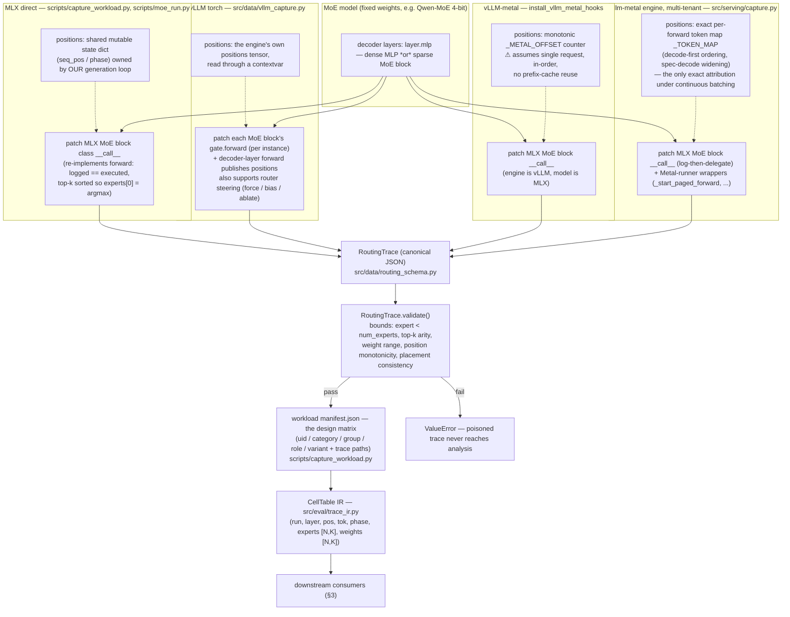
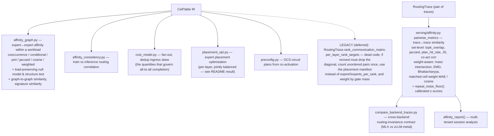

# Routing Schema — Capture Pipeline and Data Structures

This document maps how a routing decision made inside a real MoE forward pass
becomes a validated, self-describing trace on disk, and then the intermediate
representation every downstream stage consumes.

The one-line dataflow:

```
model (real) ─▶ capture patch (per backend) ─▶ RoutingTrace JSON ─▶ validate
            ─▶ workload manifest ─▶ CellTable IR ─▶ affinity / cost / placement / OCS
```

---

## 1. Capture pipeline

Four capture paths exist because the hook point must live wherever the
*batching owner* lives. All four run the same routing math
(`gate(x) → softmax → top-k → (ids, weights)`) and emit the same canonical
`RoutingTrace`; only the token-position attribution differs.



**Known calibrations / limitations of the capture layer**

* **Marginal-expert noise**: on the Metal backend the k-th (marginal) expert
  flips on near-ties under identical inputs (~5–6 % of cells, quantized-GEMM
  noise). Every comparison metric therefore also has a top-(k−1) variant
  (`k_compare`), and weight-aware metrics price these flips by gate mass
  rather than as total misses.
* **Order within top-k**: `argpartition` is unordered. Only
  `capture_workload.py` sorts the top-k by descending score, so only its
  traces guarantee `experts[:,0]` is the argmax (the invariant documented on
  `CellTable`).
* **Log-vs-execute divergence (deferred fix)**: `src/serving/capture.py`
  logs a *recomputed* gate and then delegates to the original `__call__`,
  which computes the gate a second time. Under the Metal GEMM's
  non-bit-reproducibility the logged decision can in principle diverge from
  the executed one on near-ties. The `capture_workload.py` patch style
  (re-implement the forward) avoids this at the cost of duplicating model
  code.
* **MoE-block identification** is duck-typing, not counting: a decoder layer
  is MoE iff its `mlp` exposes `switch_mlp` (plus `gate`,
  `shared_expert(_gate)` / `shared_mlp`). Dense layers carry a plain MLP.

---

## 2. Data structures

```mermaid
classDiagram
    direction LR

    class RunMeta {
        +str model_id
        +str model_type
        +int num_layers
        +int num_moe_layers
        +int num_experts
        +int top_k
        +int prompt_len
        +int generated_len
        +int total_tokens
        +str backend
        +str run_id
        recorded once per inference run;
        every validate() bound is
        expressed against these fields
    }

    class LayerRoute {
        +list~int~ experts
        +list~float~ weights
        raw top-k softmax mass
        (renormalized only if the
        block sets norm_topk_prob)
    }

    class TokenRoute {
        +int token_pos
        +int token_id
        +str token_str
        +str phase
        +dict~str,LayerRoute~ layers
    }

    class RoutingTrace {
        +RunMeta meta
        +list~int~ prompt_tokens
        +list~int~ generated_tokens
        +list~TokenRoute~ routes
        +list~list~float~~ guide_affinity?
        +dict placement?
        +save() / load()
        +validate()
        +expert_load() / per_layer_expert_load()
        +rank_communication_matrix()  %% legacy, deferred
        +per_layer_rank_targets()      %% legacy, deferred
    }

    class PlacementManifest {
        expert_to_rank
        rank_to_location
        world_size
        topology
        cost-side projection only;
        validated, never fed back
        into routing
    }

    class RunInfo {
        +int run_idx
        +str uid
        +str category / group / role / variant
        +str model_id
        +int prompt_len / generated_len / total_tokens
    }

    class CellTable {
        +int32[] run / layer / pos / tok / phase
        +int32[,] experts  [n_cells, K]
        +float32[,] weights [n_cells, K]
        +list~RunInfo~ runs
        +int num_experts / top_k
        +layers
        +select() / by_runs() / by_role() / by_layer()
        +expert_load() / per_layer_load()
        +load_balance() / layer_signature()
    }

    RoutingTrace *-- RunMeta
    RoutingTrace *-- TokenRoute
    TokenRoute *-- LayerRoute
    RoutingTrace o-- PlacementManifest
    CellTable o-- RunInfo
    RoutingTrace ..> CellTable : load_workload() / load_single_trace()<br/>(trace_ir.py)
```

**Indexing rule**: routes are indexed by *absolute token position* (not
forward-pass step), so cross-token and cross-layer analysis is trivial and
batched captures remain order-independent.

**meta vs manifest** (three distinct objects):

| object | scope | purpose |
| --- | --- | --- |
| `RunMeta` | one inference run | self-describing trace; the bounds `validate()` checks against; downstream asserts (`compare_backend_traces.py`) rely on it |
| workload `manifest.json` | whole capture session | the experimental *design matrix* (labels + trace paths) — makes every downstream number reproducible without re-running inference; consumed by `load_workload()` |
| placement manifest (`trace.placement`) | one trace | the *cost-side projection* (expert→rank, rank→location, topology). Routing is the measurement, placement is a re-projectable hypothesis: one trace can be re-costed on many topologies |

---

## 3. Downstream consumers



**Why the legacy methods are deferred**: `rank_communication_matrix` /
`per_layer_rank_targets` are never called; their semantics predate the
placement work (contiguous-placement assumption, ordered-pair double
counting, intra-rank diagonal counted as "communication"), and the cost
analysis that the project actually publishes flows through
`cost_model.py`'s fan-out and dedup-ingress-skew instead. Reviving them has
no effect on the affinity work and is intentionally left for later.

**The shared-expert path is not routing.** `y = Σ score_k·Expert_k(x) +
sigmoid(shared_expert_gate(x)) · shared_expert(x)` — the shared expert is an
always-on dense MLP, gated per token. It never enters the routing trace; it
matters only for cost accounting (per-token local compute that never leaves
the rank).
